# highschool-project
my final year project of my high school 

This is my high school web development project, built using HTML, CSS, and PHP.
The project demonstrates my early experience in creating a dynamic website with basic front-end design and server-side scripting.

✨ Features

Responsive layout with HTML & CSS.

PHP integration for handling data and server-side logic.

Simple user interface designed for accessibility and ease of use.

🛠️ Tech Stack

Frontend: HTML, CSS

Backend: PHP

📂 Project Purpose

This project was created as part of my high school coursework, giving me my first hands-on experience with web technologies and laying the foundation for my interest in software development.

## 📸 Screenshots  

### 🔑 Authentication  
- **Login Page**  
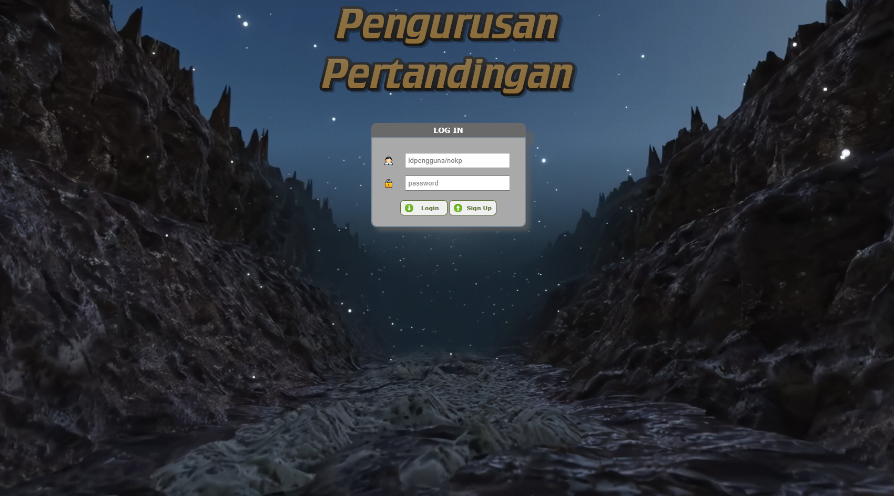  

- **Sign Up Page**  
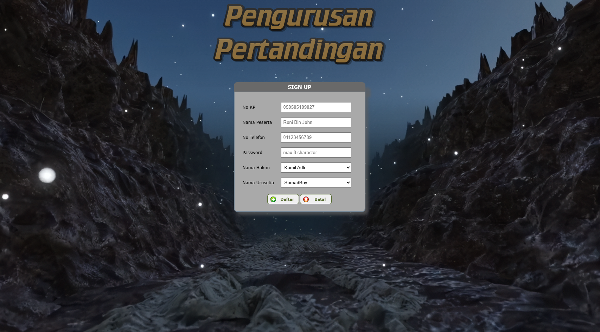  

---

### 🧑‍💻 User Dashboard  
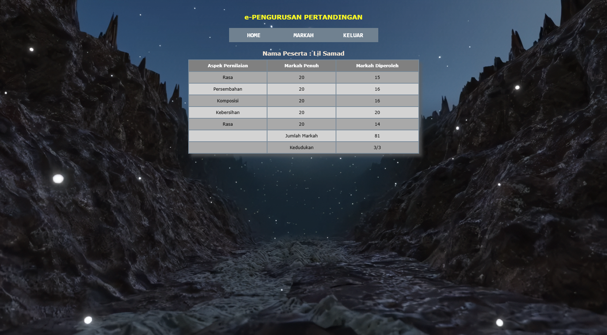  

---

### 👥 Participant Management  
- **List of Participants**  
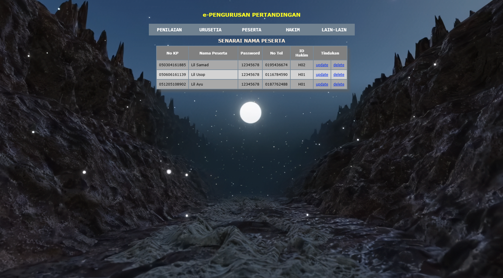  

- **Add Participant**  
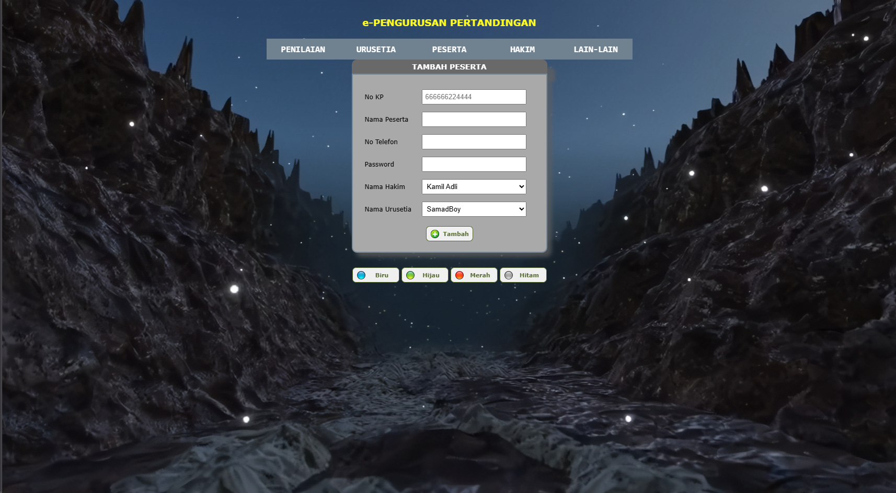  

- **Full Participant Marks**  
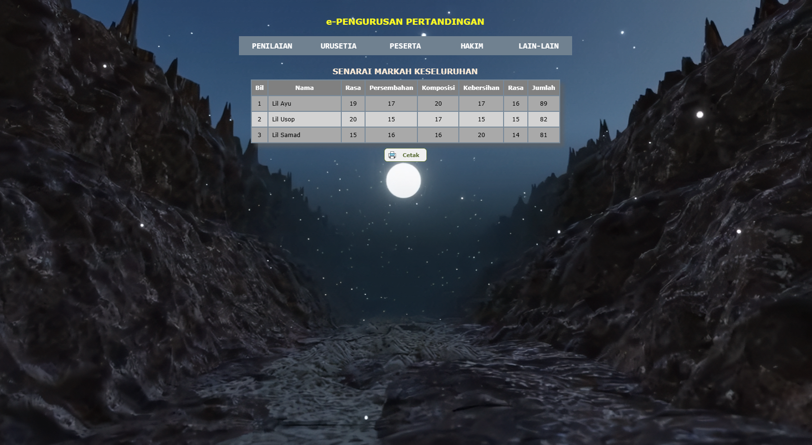  

---

### ⚖️ Judge Management  
- **List of Judges**  
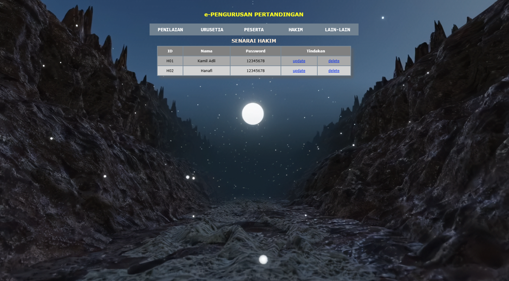  

- **Add Judge**  
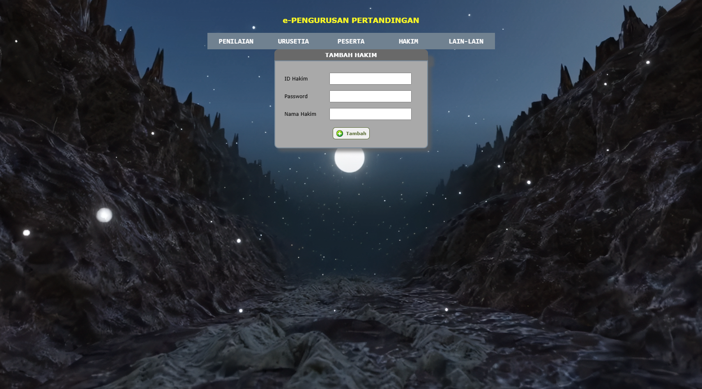  

- **List for the Judge**  
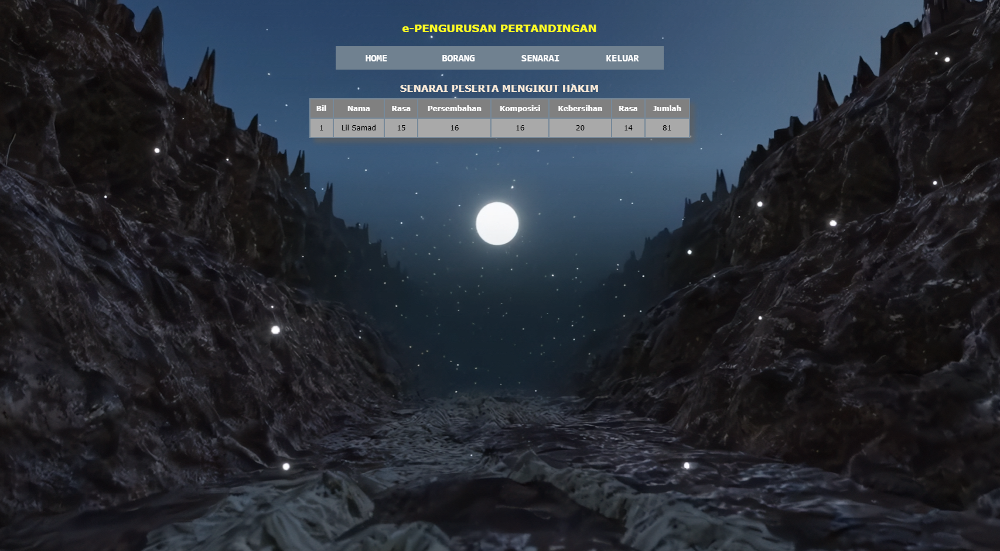  

---

### 📊 Marking System  
- **Add Aspect for Mark**  
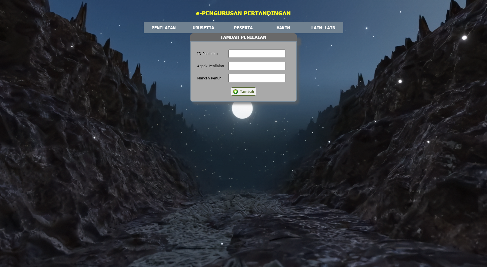  

- **Add Mark Page**  
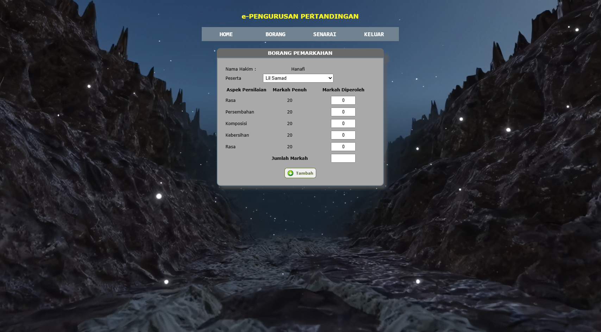  

---

### 📂 Data & Committee Management  
- **List Urusetia (Committee)**  
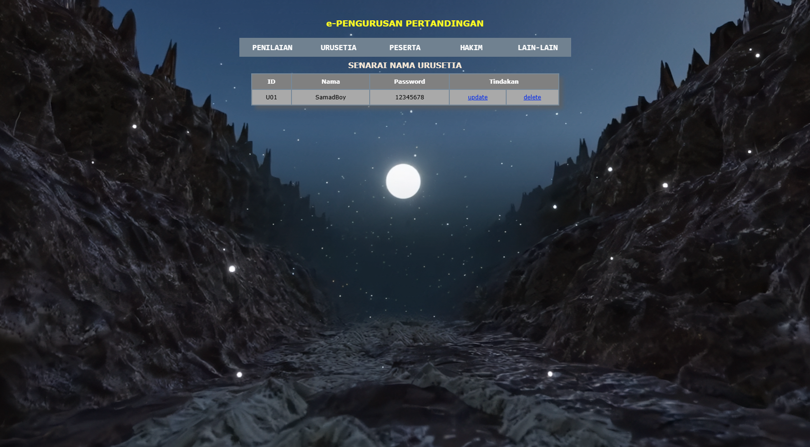  

- **Add Urusetia**  
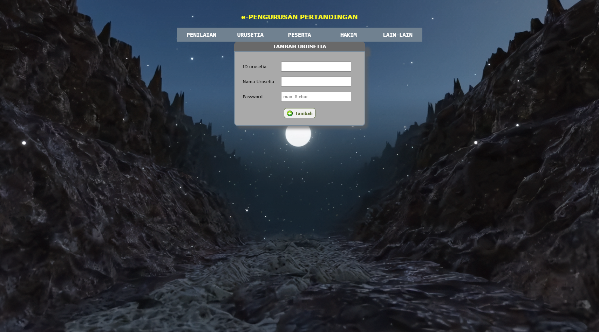  

- **Import Data**  
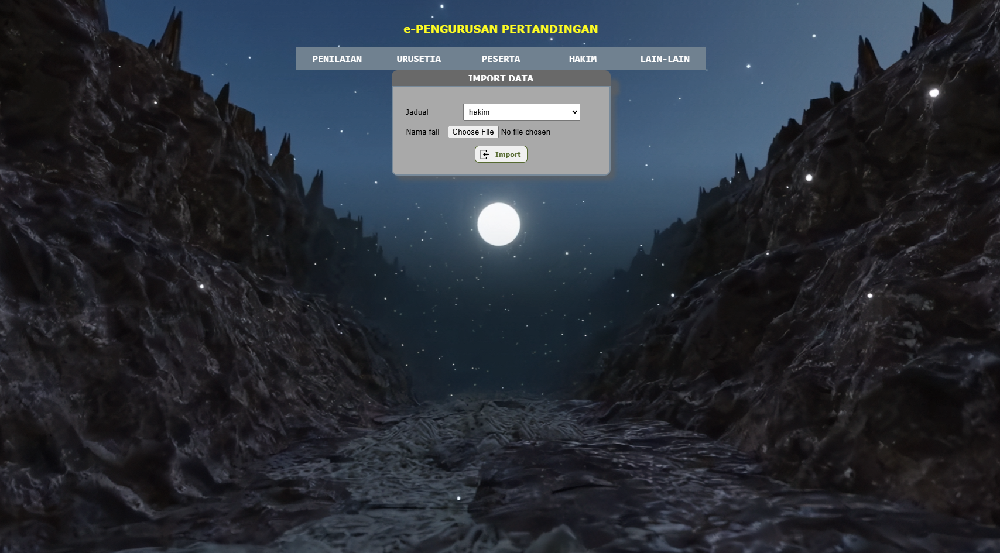  

---
